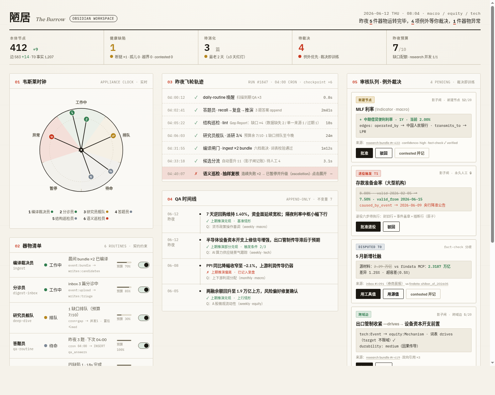

# Burrow 陋居

> 由 AI 器物照料、自己生长的知识工作区——编译闸门 + 六档时间纪律 + **挣来的自治权**。
>
> *在韦斯莱家，毛衣针自己织毛衣，煎蛋锅自己翻蛋。它们都没有自由意志——每件器物只在有限范围内被施了魔法，织什么由韦斯莱夫人决定。你的 vault 也该如此：器物整夜干活，有一道它们绕不过的闸门，信任要靠记录去挣。*

[English](README.md) · [设计哲学](docs/philosophy.md)

<p align="center"></p>

---

## 这是什么

Burrow 是一套 **Obsidian vault 模板 + agent skills**（Claude Code 或任何兼容 agent-skills 的 CLI），让你的 vault 自己生长，而不长成一团浆糊：

- **唯一写入闸门。** 器物（后台 agent）永远不直接编辑正典笔记。一切经 `burrow-ingest` 编译入库：分类、定时间档、查受控词表。INBOX 保持零摩擦——严谨只在闸门。
- **六档时间纪律。** 每条知识先裁决档位——观测 (T0) / 当前态 (T1) / 长期逻辑 (T2) / 关系 (T3) / 事件 (T4) / 类型公理 (T5)——才能落地。状态从不覆盖：旧态带着日期和事件盖章退役。你的 vault 能回答"3 月 3 日我们相信什么，后来为什么变了"。
- **挣来的自治（闸门账本）。** 器物没有一揽子写权限。每种写入类型从人工审核起步，连续 N 次批准零驳回才挣得自动晋升；一次驳回清零重计。信任是 YAML 里一个你看得见的数字。
- **自动研究飞轮。** `burrow-lint` 找缺口（缺数据、单一来源、过期状态），`burrow-research` 出门补齐，结果从同一道闸门回来。vault 不只整理你喂的东西——它会发现自己缺什么。

## 快速开始

```bash
git clone https://github.com/abuttoncc/Burrow.git
# 用 Obsidian 打开 vault-template/（或把内容拷进你的 vault）
cp -r Burrow/skills/* your-vault/.claude/skills/
cd your-vault && claude
```

往 `INBOX/` 丢任何东西，然后：

```
/burrow-ingest      # 编译入库
/burrow-routine     # 晨间仪式：recall→复盘→lint→补缺→编译→汇报
```

无人值守（Obsidian 没有后台运行时——所有同类项目都一样）：

```bash
0 4 * * * cd /path/to/vault && claude -p "/burrow-routine" >> _burrow/cron.log 2>&1
```

## 七条不变量（违反任何一条就不是 Burrow）

1. **唯一闸门**——正典写入只经 ingest
2. **捕获免费、晋升收紧**——INBOX 无规则，闸门有全部规则
3. **不裁决不落库**——每条知识必有时间档
4. **退役不删除**——状态变更 = 封旧行 + 日期 + 事件盖章
5. **受控词表**——词表外的关系被拒绝
6. **自治是挣来的**——自动晋升靠零驳回连胜，一次驳回降级
7. **回答带来源**——recall 引用出处或报告缺口，绝不用自信填补沉默

## 架构：两层，两档

Burrow 内置 **[auto-wiki](https://github.com/hanlinlibham/auto-wiki)**（v0.3，`skills/auto-wiki/`）作为编译引擎——**引擎决定知识怎么编译，账本决定谁有权落地**：

- **Lite 档（零依赖）**——不装引擎，闸门按 `_protocols/` 的纯 markdown 协议运行，任何 agent 可跑
- **引擎档（完全体）**——装上 `skills/auto-wiki/`（Python 3.8+ 与 `pip install pydantic`），获得 SQLite 双时态存储（data.db）、frontmatter schema 校验、领域种子（如 FIBO 年金）、逻辑校验器、大库 BM25 检索

## Skills 一览

| Skill | 角色 |
|---|---|
| `auto-wiki` | **编译引擎**（内置）：ingest/recall/query/lint/deep-dive 编译核心 |
| `burrow-ingest` | **闸门本体**：路由→抽取→六档裁决→词表校验→暂存→晋升/排队（唯一能写 `wiki/` 的） |
| `burrow-gate` | 审核队列 + 账本记账：批准/驳回/contested，更新连胜 |
| `burrow-lint` | 体检：孤儿/断链/越界边/contested/过期 → Gap Report |
| `burrow-research` | 接缺口出门研究，证据包**送回闸门** |
| `burrow-routine` | 飞轮一键转：到期问题→recall→复盘→lint→补缺→编译→日志 |
| `burrow-recall` | 时间旅行查询："截至某日"带出处作答，答不出报缺口 |

## 控制面板（原型）

正在朝这个晨间视图迭代——**韦斯莱时钟**（每根指针是一个器物，扇区是状态：工作中/排队/待命/暂停/异常）+ 飞轮轨迹 + 审核队列 + 可见的信任账本：

<p align="center"></p>

可交互 HTML 原型：[docs/dashboard-prototype.html](docs/dashboard-prototype.html)——可以实际批准/驳回卡片看账本变化、暂停器物看时钟指针摆动。

## License

MIT
